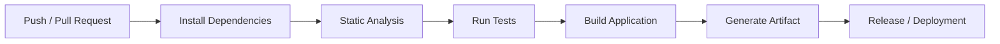
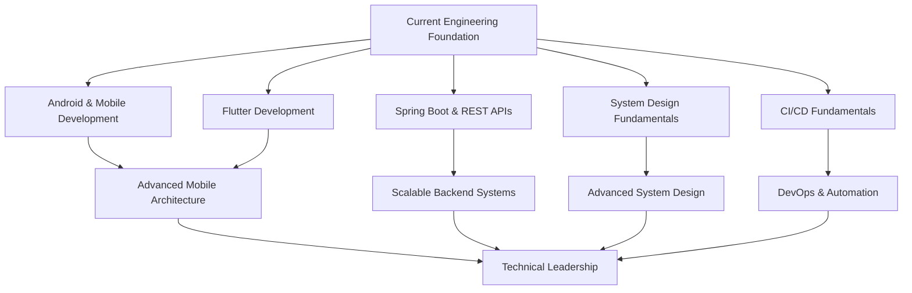

# 👋 Hi, I'm Gurpreet Singh

### Senior Mobile Developer | Android • Flutter • Java • Spring Boot

I build **scalable, maintainable, and production-ready applications** across mobile and backend platforms.

With extensive experience in Android development and cross-platform application development, I focus on writing clean code, designing maintainable architectures, building reliable APIs, and automating development workflows.

Currently expanding my expertise in **backend architecture, system design, microservices, cloud technologies, and CI/CD automation**.

<br/>

## 🚀 What I Do

* 📱 Build native Android applications
* 💙 Develop cross-platform applications using Flutter
* ☕ Build RESTful backend APIs with Java & Spring Boot
* 🏗 Design scalable application architectures
* 🔐 Implement authentication, authorization, and secure API communication
* ⚙️ Automate builds, testing, and releases using CI/CD
* 🧩 Create reusable components and shared libraries
* 📈 Focus on code quality, maintainability, and long-term scalability

---

## 🛠 Tech Stack

### Mobile Development


### Backend Development


### Architecture & Engineering


### DevOps & Tools


---

# ⭐ Featured Work

## 📱 Mobile Applications

I build Android and Flutter applications with a focus on:

* Clean Architecture
* MVVM and scalable state management
* REST API integration
* Reusable UI components
* Local data persistence
* Authentication and secure communication
* Error handling and validation
* Performance and maintainability

---

## 🧩 Flutter Core Package

A reusable Flutter foundation designed to reduce boilerplate and provide a consistent architecture across projects.

### Includes

* 🎨 Common UI components
* 📱 Reusable app bars and widgets
* 🌗 Theme configuration
* 🌐 API calling infrastructure
* 📦 Base request and response models
* ⚠️ Global exception handling
* ✅ Common validations
* 🛠 Utilities and helper functions
* 🏗 Shared project foundation

> **Goal:** Build new Flutter applications faster while maintaining consistency, scalability, and clean architecture.

---

## ☕ Backend & API Development

I am actively building backend applications using **Java and Spring Boot**.

My focus includes:

```text
REST APIs
├── Authentication & Authorization
├── JWT Security
├── Request Validation
├── Global Exception Handling
├── Database Integration
├── PostgreSQL
├── Clean Architecture
└── API Documentation
```

I am also exploring how backend systems evolve from a traditional monolith toward **modular monoliths and microservices architectures**.

---

# 🏗 Engineering Principles

I believe good software is not just about making features work.

My approach focuses on:

```text
Clean Code
      ↓
Maintainable Architecture
      ↓
Reusable Components
      ↓
Automated Testing
      ↓
CI/CD Automation
      ↓
Reliable Deployments
      ↓
Scalable Systems
```

Key principles I try to follow:

* Separation of concerns
* SOLID principles
* Clean Architecture
* Reusable and modular code
* Meaningful error handling
* Consistent API design
* Automated quality checks
* Documentation-first thinking
* Continuous improvement

---

# ⚙️ CI/CD & Automation

I am actively working with **GitHub Actions** to automate development workflows.

Typical pipeline:



### Automation Areas

* 🔍 Static code analysis
* 🧪 Automated testing
* 📦 APK and application builds
* 📁 Build artifact generation
* 🚀 Release automation
* 🔄 Pull request validation

---

# 📚 Currently Exploring

I believe continuous learning is essential for building better software.

Currently focusing on:

### Mobile

* Jetpack Compose
* Advanced Flutter Architecture
* Flutter package development
* Performance optimization
* Automated testing

### Backend

* Advanced Spring Boot
* Spring Security
* Microservices
* Modular Monolith Architecture
* API Gateway patterns
* Event-driven architecture

### System Design

* Scalable application architecture
* Caching strategies
* Message queues
* Distributed systems fundamentals
* Database design
* High-level system design

### DevOps

* Advanced GitHub Actions
* Docker
* Kubernetes fundamentals
* CI/CD pipelines
* Monitoring and logging

---

# 🗺 My Engineering Roadmap

I already have hands-on experience across **Mobile Development, Flutter, Spring Boot, REST APIs, System Design, and CI/CD fundamentals**.

My current focus is on strengthening these skills and progressing toward designing and leading more scalable, production-grade systems.




# 🎯 Professional Focus

My long-term goal is to grow from application development into a broader engineering role involving:

* 🏗 Software Architecture
* 📱 Mobile Engineering Leadership
* ⚙️ Backend & Distributed Systems
* 🔄 CI/CD and Engineering Automation
* 👥 Technical Leadership
* 📊 System Design and Scalability

I am particularly interested in roles where I can contribute not only by writing code, but also by improving:

**Mobile Engineering • Backend Development • System Design • Automation • Scalable Architecture • Technical Leadership**

---

# 📂 What You'll Find in My GitHub

### 📱 Mobile Applications

Android and Flutter projects demonstrating real-world application development.

### 🧩 Reusable Libraries

Packages and reusable components designed to reduce boilerplate and improve consistency.

### ☕ Backend Applications

Java and Spring Boot REST APIs with authentication, database integration, and scalable architecture.

### ⚙️ CI/CD Examples

GitHub Actions workflows for automated testing, analysis, builds, artifacts, and releases.

### 🧪 Learning Labs

Focused repositories for experimenting with new technologies, frameworks, and architectural patterns.

---

# 🤝 Open Source & Collaboration

I'm always interested in:

* Improving existing projects
* Learning from other developers
* Exploring new architectures
* Contributing to useful open-source projects
* Sharing technical knowledge

If you find something useful in my repositories, feel free to ⭐ the project or connect with me.

---

📊 GitHub Stats
<p align="center">   </p> <p align="center">  </p>
 

# 📫 Get in Touch

<p align="left">

<a href="https://www.linkedin.com/in/gurpreets11/">
  
</a>

<a href="https://stackoverflow.com/users/1117424/gurpreets11">
  
</a>

<a href="mailto:java.preetsingh@gmail.com">
  
</a>

<a href="https://github.com/Gurpreets11">
  
</a>

<a href="https://www.instagram.com/gurpreets_11/">
  
</a>

</p>


---

<p align="center">
  <i>"Great software is built through continuous learning, thoughtful architecture, and attention to detail."</i>
</p>

<p align="center">
  ⭐ Thanks for visiting my profile!
</p>
